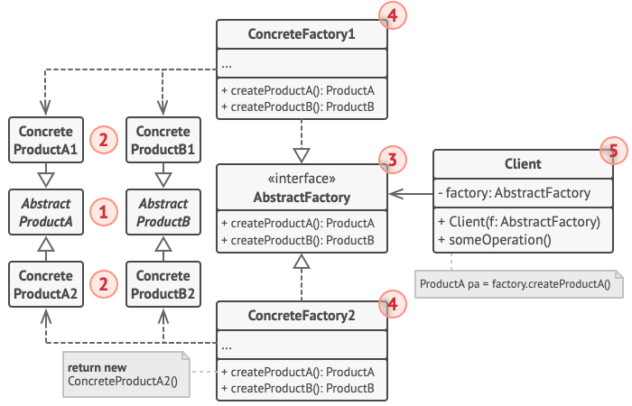
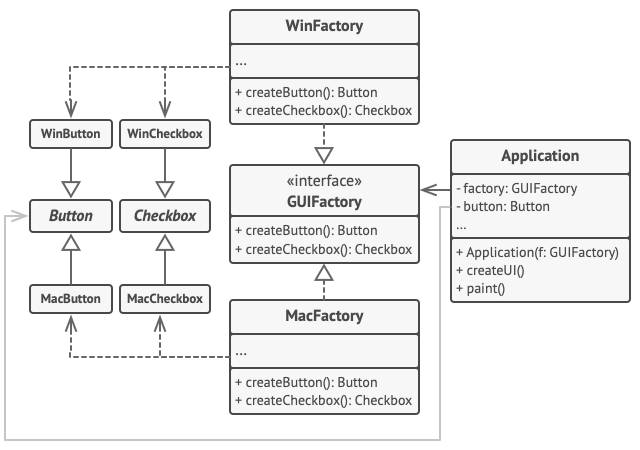

# 抽象工厂模式结构

1、抽象产品 （Abstract Product） 为构成系列产品的一组不同但相关的产品声明接口。

2、具体产品 （Concrete Product） 是抽象产品的多种不同类型实现。 所有变体 （维多利亚/现代） 都必须实现相应的抽象产品 （椅子/沙发）。

3、抽象工厂 （Abstract Factory） 接口声明了一组创建各种抽象产品的方法。

4、具体工厂 （Concrete Factory） 实现抽象工厂的构建方法。 每个具体工厂都对应特定产品变体， 且仅创建此种产品变体。

5、尽管具体工厂会对具体产品进行初始化， 其构建方法签名必须返回相应的抽象产品。 这样， 使用工厂类的客户端代码就不会与工厂创建的特定产品变体耦合。
客户端 （Client） 只需通过抽象接口调用工厂和产品对象， 就能与任何具体工厂/产品变体交互。

# Demo

下面例子通过应用抽象工厂模式， 使得客户端代码无需与具体 UI 类耦合， 就能创建跨平台的 UI 元素， 同时确保所创建的元素与指定的操作系统匹配。

</img>

# 抽象工厂模式适合应用场景

- 如果代码需要与多个不同系列的相关产品交互， 但是由于无法提前获取相关信息， 或者出于对未来扩展性的考虑，
  你不希望代码基于产品的具体类进行构建， 在这种情况下， 你可以使用抽象工厂。
- 抽象工厂为你提供了一个接口， 可用于创建每个系列产品的对象。 只要代码通过该接口创建对象， 那么你就不会生成与应用程序已生成的产品类型不一致的产品。
- 如果你有一个基于一组抽象方法的类， 且其主要功能因此变得不明确， 那么在这种情况下可以考虑使用抽象工厂模式。
- 在设计良好的程序中， 每个类仅负责一件事。 如果一个类与多种类型产品交互， 就可以考虑将工厂方法抽取到独立的工厂类或具备完整功能的抽象工厂类中。

# 实现方式

1、以不同的产品类型与产品变体为维度绘制矩阵。

2、为所有产品声明抽象产品接口。 然后让所有具体产品类实现这些接口。

3、声明抽象工厂接口， 并且在接口中为所有抽象产品提供一组构建方法。

4、为每种产品变体实现一个具体工厂类。

5、在应用程序中开发初始化代码。 该代码根据应用程序配置或当前环境， 对特定具体工厂类进行初始化。 然后将该工厂对象传递给所有需要创建产品的类。

6、找出代码中所有对产品构造函数的直接调用， 将其替换为对工厂对象中相应构建方法的调用。

# 抽象工厂模式优缺点

* 优点
    * 你可以确保同一工厂生成的产品相互匹配。
    * 你可以避免客户端和具体产品代码的耦合。
    * 单一职责原则。 你可以将产品生成代码抽取到同一位置， 使得代码易于维护。
    * 开闭原则。 向应用程序中引入新产品变体时， 你无需修改客户端代码。
* 缺点
    * 由于采用该模式需要向应用中引入众多接口和类， 代码可能会比之前更加复杂。