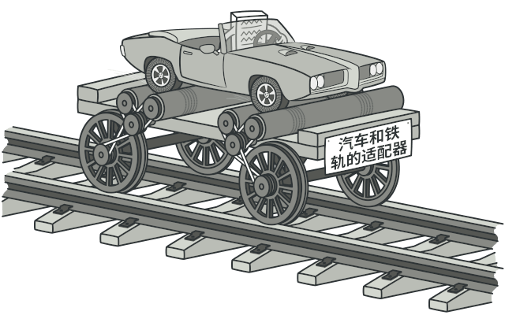
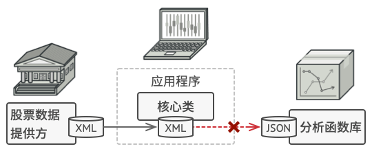
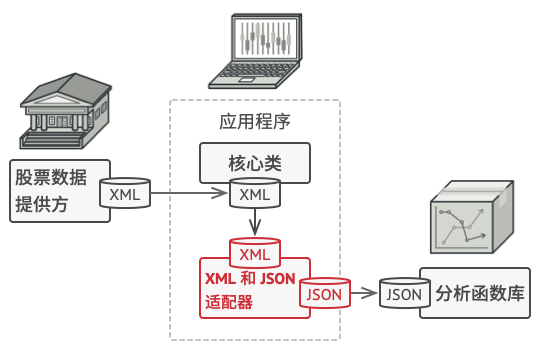
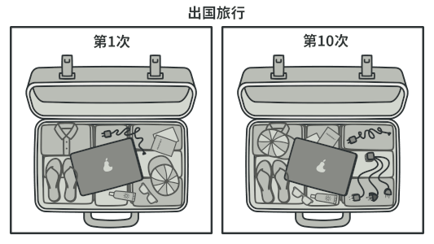
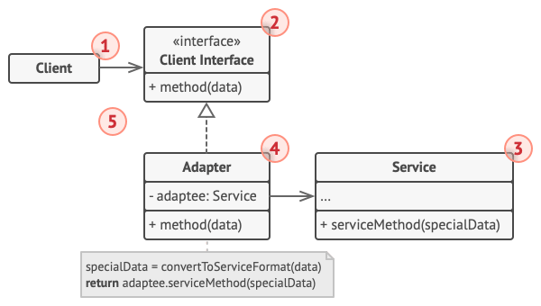

# 适配器模式

适配器模式是一种结构型设计模式， 它能使接口不兼容的对象能够相互合作。

</img>

# 问题

假如你正在开发一款股票市场监测程序， 它会从不同来源下载 XML 格式的股票数据， 然后向用户呈现出美观的图表。

在开发过程中， 你决定在程序中整合一个第三方智能分析函数库。 但是遇到了一个问题， 那就是分析函数库只兼容 JSON 格式的数据。

</img>

`你无法 “直接” 使用分析函数库， 因为它所需的输入数据格式与你的程序不兼容。`

你可以修改程序库来支持 XML。 但是， 这可能需要修改部分依赖该程序库的现有代码。 甚至还有更糟糕的情况， 你可能根本没有程序库的源代码，
从而无法对其进行修改。

# 解决方案

你可以创建一个适配器。 这是一个特殊的对象， 能够转换对象接口， 使其能与其他对象进行交互。

适配器模式通过封装对象将复杂的转换过程隐藏于幕后。 被封装的对象甚至察觉不到适配器的存在。 例如， 你可以使用一个将所有数据转换为英制单位
（如英尺和英里） 的适配器封装运行于米和千米单位制中的对象。

适配器不仅可以转换不同格式的数据， 其还有助于采用不同接口的对象之间的合作。 它的运作方式如下：

1. 适配器实现与其中一个现有对象兼容的接口。
2. 现有对象可以使用该接口安全地调用适配器方法。
3. 适配器方法被调用后将以另一个对象兼容的格式和顺序将请求传递给该对象。

有时你甚至可以创建一个双向适配器来实现双向转换调用。

</img>

让我们回到股票市场程序。 为了解决数据格式不兼容的问题， 你可以为分析函数库中的每个类创建将 XML 转换为 JSON 格式的适配器，
然后让客户端仅通过这些适配器来与函数库进行交流。 当某个适配器被调用时， 它会将传入的 XML 数据转换为 JSON 结构，
并将其传递给被封装分析对象的相应方法。

# 真实世界类比

</img>

`出国旅行前后的旅行箱。`

如果你是第一次从美国到欧洲旅行， 那么在给笔记本充电时可能会大吃一惊。 不同国家的电源插头和插座标准不同。 美国插头和德国插座不匹配。
同时提供美国标准插座和欧洲标准插头的电源适配器可以解决你的难题。

# 适配器模式结构

## 对象适配器

实现时使用了构成原则： 适配器实现了其中一个对象的接口， 并对另一个对象进行封装。 所有流行的编程语言都可以实现适配器。

</img>

1. 客户端 （Client） 是包含当前程序业务逻辑的类。
2. 客户端接口 （Client Interface） 描述了其他类与客户端代码合作时必须遵循的协议。
3. 服务 （Service） 中有一些功能类 （通常来自第三方或遗留系统）。 客户端与其接口不兼容， 因此无法直接调用其功能。
4. 适配器 （Adapter） 是一个可以同时与客户端和服务交互的类： 它在实现客户端接口的同时封装了服务对象。 适配器接受客户端通过适配器接口发起的调用，
   并将其转换为适用于被封装服务对象的调用。
5. 客户端代码只需通过接口与适配器交互即可， 无需与具体的适配器类耦合。 因此， 你可以向程序中添加新类型的适配器而无需修改已有代码。
   这在服务类的接口被更改或替换时很有用： 你无需修改客户端代码就可以创建新的适配器类。

# Demo

下列适配器模式演示基于经典的 “方钉和圆孔” 问题。

</img>

# 适配器模式适合应用场景

**当你希望使用某个类， 但是其接口与其他代码不兼容时， 可以使用适配器类。**

适配器模式允许你创建一个中间层类， 其可作为代码与遗留类、 第三方类或提供怪异接口的类之间的转换器。

**如果您需要复用这样一些类， 他们处于同一个继承体系， 并且他们又有了额外的一些共同的方法， 但是这些共同的方法不是所有在这一继承体系中的子类所具有的共性。
**

你可以扩展每个子类， 将缺少的功能添加到新的子类中。 但是， 你必须在所有新子类中重复添加这些代码， 这样会使得代码有坏味道。

将缺失功能添加到一个适配器类中是一种优雅得多的解决方案。 然后你可以将缺少功能的对象封装在适配器中， 从而动态地获取所需功能。
如要这一点正常运作， 目标类必须要有通用接口， 适配器的成员变量应当遵循该通用接口。 这种方式同装饰模式非常相似。

# 适配器模式优缺点

- 优点
    - 单一职责原则你可以将接口或数据转换代码从程序主要业务逻辑中分离。
    - 开闭原则。 只要客户端代码通过客户端接口与适配器进行交互， 你就能在不修改现有客户端代码的情况下在程序中添加新类型的适配器。
- 缺点
    - 代码整体复杂度增加， 因为你需要新增一系列接口和类。 有时直接更改服务类使其与其他代码兼容会更简单。
