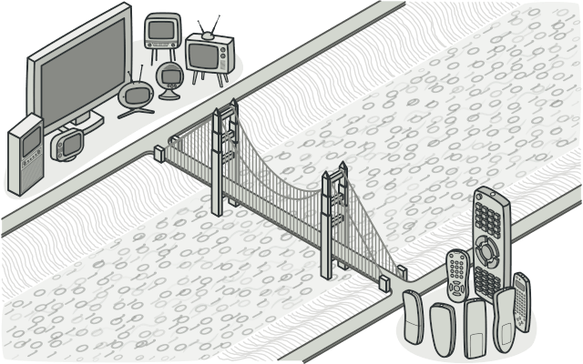
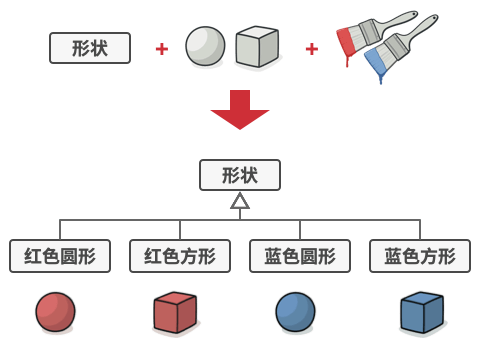
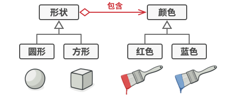
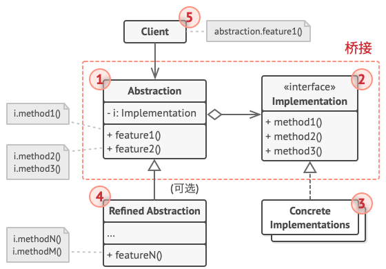
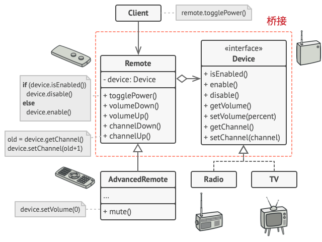

# 桥接模式

桥接模式是一种结构型设计模式， 可将一个大类或一系列紧密相关的类拆分为抽象和实现两个独立的层次结构， 从而能在开发时分别使用。

</img>

# 问题

抽象？ 实现？ 听上去挺吓人？ 让我们慢慢来， 先考虑一个简单的例子。

假如你有一个几何 形状Shape类， 从它能扩展出两个子类：圆形Circle和方形Square 。 你希望对这样的类层次结构进行扩展以使其包含颜色，
所以你打算创建名为红色Red和蓝色Blue的形状子类。 但是，由于你已有两个子类， 所以总共需要创建四个类才能覆盖所有组合， 例如
蓝色圆形BlueCircle和红色方形RedSquare 。

</img>

`所有组合类的数量将以几何级数增长。`

在层次结构中新增形状和颜色将导致代码复杂程度指数增长。 例如添加三角形状， 你需要新增两个子类， 也就是每种颜色一个；
此后新增一种新颜色需要新增三个子类， 即每种形状一个。 如此以往， 情况会越来越糟糕。

# 解决方案

问题的根本原因是我们试图在两个独立的维度——形状与颜色——上扩展形状类。 这在处理类继承时是很常见的问题。

桥接模式通过将继承改为组合的方式来解决这个问题。 具体来说， 就是抽取其中一个维度并使之成为独立的类层次，
这样就可以在初始类中引用这个新层次的对象， 从而使得一个类不必拥有所有的状态和行为。

</img>

`将一个类层次转化为多个相关的类层次， 避免单个类层次的失控。`

根据该方法，我们可以将颜色相关的代码抽取到拥有红色和蓝色两个子类的颜色类中， 然后在 形状类中添加一个指向某一颜色对象的引用成员变量。
现在，形状类可以将所有与颜色相关的工作委派给连入的颜色对象。 这样的引用就成为了形状和颜色之间的桥梁。 此后，
新增颜色将不再需要修改形状的类层次， 反之亦然。

# 桥接模式结构

</img>

1. 抽象部分 （Abstraction） 提供高层控制逻辑， 依赖于完成底层实际工作的实现对象。
2. 实现部分 （Implementation） 为所有具体实现声明通用接口。 抽象部分仅能通过在这里声明的方法与实现对象交互。
   抽象部分可以列出和实现部分一样的方法， 但是抽象部分通常声明一些复杂行为， 这些行为依赖于多种由实现部分声明的原语操作。
3. 具体实现 （Concrete Implementations） 中包括特定于平台的代码。
4. 精确抽象 （Refined Abstraction） 提供控制逻辑的变体。 与其父类一样， 它们通过通用实现接口与不同的实现进行交互。
5. 通常情况下， 客户端 （Client） 仅关心如何与抽象部分合作。 但是， 客户端需要将抽象对象与一个实现对象连接起来。

# Demo

</img>

# 桥接模式适合应用场景

1. **如果你想要拆分或重组一个具有多重功能的庞杂类 （例如能与多个数据库服务器进行交互的类）， 可以使用桥接模式。**

   类的代码行数越多， 弄清其运作方式就越困难， 对其进行修改所花费的时间就越长。 一个功能上的变化可能需要在整个类范围内进行修改，
   而且常常会产生错误， 甚至还会有一些严重的副作用。

   桥接模式可以将庞杂类拆分为几个类层次结构。 此后， 你可以修改任意一个类层次结构而不会影响到其他类层次结构。
   这种方法可以简化代码的维护工作，
   并将修改已有代码的风险降到最低。

2. **如果你希望在几个独立维度上扩展一个类， 可使用该模式。**

   桥接建议将每个维度抽取为独立的类层次。 初始类将相关工作委派给属于对应类层次的对象， 无需自己完成所有工作。

3. **如果你需要在运行时切换不同实现方法， 可使用桥接模式。**

   当然并不是说一定要实现这一点， 桥接模式可替换抽象部分中的实现对象， 具体操作就和给成员变量赋新值一样简单。

   顺便提一句， 最后一点是很多人混淆桥接模式和策略模式的主要原因。 记住， 设计模式并不仅是一种对类进行组织的方式，
   它还能用于沟通意图和解决问题。

# 桥接模式优缺点

* 优点
    * 你可以创建与平台无关的类和程序。
    * 客户端代码仅与高层抽象部分进行互动， 不会接触到平台的详细信息。
    * 开闭原则。 你可以新增抽象部分和实现部分， 且它们之间不会相互影响。
    * 单一职责原则。 抽象部分专注于处理高层逻辑， 实现部分处理平台细节。
* 缺点
    * 对高内聚的类使用该模式可能会让代码更加复杂。