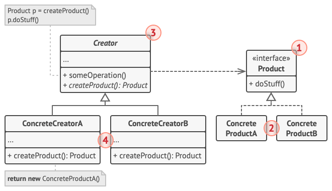
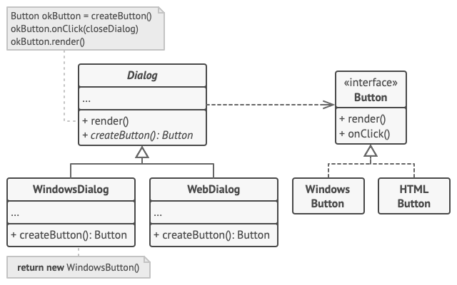

# 工厂方法模式适合应用场景

当你在编写代码的过程中， 如果无法预知对象确切类别及其依赖关系时， 可使用工厂方法。

工厂方法将创建产品的代码与实际使用产品的代码分离， 从而能在不影响其他代码的情况下扩展产品创建部分代码。

例如， 如果需要向应用中添加一种新产品， 你只需要开发新的创建者子类， 然后重写其工厂方法即可。

如果你希望用户能扩展你软件库或框架的内部组件， 可使用工厂方法。

# 工厂方法模式结构

1、产品 （Product） 将会对接口进行声明。 对于所有由创建者及其子类构建的对象， 这些接口都是通用的。

2、具体产品 （Concrete Products） 是产品接口的不同实现。

3、创建者 （Creator） 类声明返回产品对象的工厂方法。 该方法的返回对象类型必须与产品接口相匹配。

你可以将工厂方法声明为抽象方法， 强制要求每个子类以不同方式实现该方法。 或者， 你也可以在基础工厂方法中返回默认产品类型。

注意， 尽管它的名字是创建者， 但它最主要的职责并不是创建产品。 一般来说， 创建者类包含一些与产品相关的核心业务逻辑。
工厂方法将这些逻辑处理从具体产品类中分离出来。 打个比方， 大型软件开发公司拥有程序员培训部门。 但是， 这些公司的主要工作还是编写代码，
而非生产程序员。

4、具体创建者 （Concrete Creators） 将会重写基础工厂方法， 使其返回不同类型的产品。

注意， 并不一定每次调用工厂方法都会创建新的实例。 工厂方法也可以返回缓存、 对象池或其他来源的已有对象。

# 工厂方法模式优缺点

优点：

- 你可以避免创建者和具体产品之间的紧密耦合。
- 单一职责原则。 你可以将产品创建代码放在程序的单一位置， 从而使得代码更容易维护。
- 开闭原则。 无需更改现有客户端代码， 你就可以在程序中引入新的产品类型。

缺点：

- 应用工厂方法模式需要引入许多新的子类， 代码可能会因此变得更复杂。 最好的情况是将该模式引入创建者类的现有层次结构中。

# 与其他模式的关系

- 在许多设计工作的初期都会使用工厂方法模式（较为简单， 可以更方便地通过子类进行定制）， 随后演化为使用抽象工厂模式、
  原型模式或生成器模式（更灵活但更加复杂）。
- 抽象工厂模式通常基于一组工厂方法，但也可以基于单个工厂方法。
- 你可以将抽象工厂模式与迭代器模式来让子类集合返回不同类型的迭代器，并使得迭代器与集合相匹配。
- 原型并不基于继承， 因此没有继承的缺点。 另一方面， 原型需要对被复制对象进行复杂的初始化。 工厂方法基于继承， 但是它不需要初始化步骤。
- 工厂方法是模板方法模式的一种特殊形式。 同时， 工厂方法可以作为一个大型模板方法中的一个步骤。